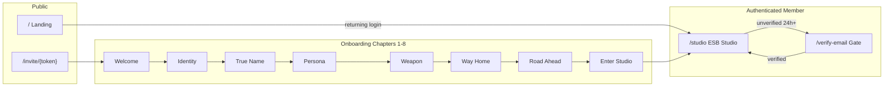

# Information Architecture

Status: PH048A Amended (Narrative Onboarding Experience Governance)  
Authority: `docs/PROJECT_CHARTER.md`  
Purpose: Canonical navigation structure, hierarchy, and visibility rules for the Live Performance Orchestration System

UX behaviour and workflows: `docs/UX_MODEL.md`

---

## Core Principle

**The application is Show-centric.**

Everything operates within an **Active Show** context after show selection.

Show-time execution (Live Show View, Soundcheck) operates on an active **Performance** within that Show. The Director runs a Performance, not a Show alone — but navigation is organised by Show.

---

## Primary Navigation Flow

```
Login
 ↓
Shows
 ↓
Select Active Show
 ↓
Show Dashboard (Active Show hub)
```

### Purpose

| Step | Purpose |
|------|---------|
| **Login** | Authenticate user; establish Band context. |
| **Shows** | List available Shows; select the production variant for this session. |
| **Select Active Show** | Bind all subsequent navigation to one Show. |
| **Show Dashboard** | Hub for preparation, Soundcheck, and Performance entry. |

---

## Active Show Navigation

After selecting a Show, the following screens are available within Active Show context:

```
Active Show

├─ Playlist
├─ Console
├─ Lights
├─ Musicians
├─ Stage Plot
├─ Tech Rider
├─ Instruments
├─ Assignments
├─ Monitor Assignments
└─ Soundcheck
```

### Show-Time Screens (within Active Show)

Accessed via Performance selection on Show Dashboard:

```
Active Show → Select Performance

├─ Live Show View          ← Priority 1 (runtime)
└─ Soundcheck              ← Priority 2 (pre-show; also reachable from nav above)
```

### Navigation Hierarchy

```
Band
 └── Shows
      └── Active Show                    ← primary context boundary
           ├── Preparation screens       ← Playlist, Assignments, Console, etc.
           ├── Performances               ← venue/date occurrences
           │    ├── Soundcheck
           │    └── Live Show View
           └── Show Dashboard             ← hub
```

---

## Screen Purpose & Visibility

| Screen | Purpose | Visible To | When |
|--------|---------|------------|------|
| **Login** | Authentication | All | Entry |
| **Shows** | Show selection | Director, Tech, Administrator | After login |
| **Show Dashboard** | Active Show hub | Director, Tech | Active Show selected |
| **Playlist** | Imported song order; PGM mapping | Director | Preparation; read-only at show time |
| **Console** | X32 / Mix Move context | Director, Tech | Preparation and show time |
| **Lights** | Light Mode context | Director, Tech | Preparation and show time |
| **Musicians** | Available musicians; device connections | Director | Preparation and show day |
| **Stage Plot** | Spatial layout document | Director, Tech | Preparation |
| **Tech Rider** | Technical requirements document | Director, Tech | Preparation |
| **Instruments** | Instrument Part requirements for Show | Director | Preparation |
| **Assignments** | Musician ↔ Instrument Part mapping | Director | Preparation; referenced at show time |
| **Monitor Assignments** | Monitor mix routing | Director, Tech | Preparation, Soundcheck, show time |
| **Soundcheck** | Pre-performance validation | Director, Musicians, Tech | Show day, pre-performance |
| **Live Show View** | Live runtime operator view | Director, Tech | Live performance only |

---

## Musician Device Navigation

Separate path from Show-centric Director app. See `docs/UX_MODEL.md` §PH003.05.

```
Login
 ↓
My Performances
 ↓
Current Performance (Musician Device View)
```

| Screen | Purpose | Visible To | When |
|--------|---------|------------|------|
| **My Performances** | List Performances musician is assigned to | Musician | After login |
| **Current Performance** | Cue context, charts, instructions, monitoring | Musician | Soundcheck and live performance |

---

## Master Library Navigation

Not part of Active Show flow. Accessed from global navigation when managing reusable assets.

```
Master Library

├─ Songs
│   ├─ Charts
│   ├─ Snippets
│   ├─ Cues
│   └─ Actions
├─ Musicians
├─ Band People
│   ├─ People (profiles)
│   ├─ Secure Fields (encrypted)
│   ├─ Files (private by default)
│   ├─ Instrument Reference
│   └─ IEM Templates
├─ Devices
├─ Instrument Parts
├─ Capabilities
├─ Mix Moves
├─ Light Modes
└─ Production Configurations
```

### Visibility Rules

| Rule | Statement |
|------|-----------|
| Not primary workflow | Master Library is not the default entry point. |
| Supports Shows | Assets are created/maintained here; Shows reference them. |
| Not show-time | Master Library editing is not available during live performance. |
| Director primary | Director is primary user; Administrator for band-level access. |
| Band People shared | Band People screens use canonical `people` schema — same data model for local admin and website/festival workflows; not a separate website database. |
| Artifacts generated | Stage Plot, Tech Rider, festival pack, and export outputs are generated from canonical data — not separate personnel navigation trees. |

---

## Frontend Priority (Navigation Weight)

Navigation prominence follows priority order. See `docs/UX_MODEL.md` §PH003.03.

| Priority | Surfaces |
|----------|----------|
| 1 | Live Show View |
| 2 | Soundcheck |
| 3 | Show Preparation (Active Show screens) |
| 4 | Master Library |

Live Show View receives shortest path from Performance selection. Master Library is deprioritised in global navigation.

---

## Context Hierarchy

| Context | Scope | Primary User | Navigation Entry |
|---------|-------|--------------|------------------|
| Band | Organisation | Director, Administrator | Post-login |
| Active Show | Production variant | Director, Tech | Shows → Select |
| Performance | Venue/date occurrence | Director | Active Show → Performances |
| Live Show View | Runtime execution | Director, Tech | Performance → Live |
| Musician Device View | Individual musician | Musician | My Performances → Current |
| Master Library | Global assets | Director | Global nav (secondary) |

---

## Screen-to-Domain Mapping

| Screen | Primary Entities |
|--------|------------------|
| Live Show View | Performance, Ableton Protocol State, Assignment, Action |
| Soundcheck | Performance, Soundcheck, Readiness, Device, Musician, Assignment |
| Playlist | Show, Song (imported from Ableton Show File) |
| Console | Mix Move, Action |
| Lights | Light Mode, Action |
| Musicians | Musician, Device, Performance |
| Band People | Person, Person Secure Field, Person File, Instrument Reference, Person IEM Setting |
| Band Portal (login) | User (authentication only) |
| Band Portal (onboarding Ch 1–8) | Person Invitation (proposed), User, Person, Instrument Reference |
| ESB Studio | User, Person (member home — PH048A) |
| Band Portal (email verification) | Person (email contact), User (access gate) |
| Band Portal (onboarding Ch 1–8) | Person Invitation (proposed), User, Person, Instrument Reference |
| ESB Studio | User, Person (member home — PH048A) |
| Band Portal (email verification) | Person (email contact), User (access gate) |
| Band Portal (invitation) | Person Invitation (proposed), Person |
| Band Portal (onboarding) | Person, Person File, Person IEM Setting, onboarding progress (proposed) |
| Assignments | Assignment, Musician, Instrument Part, Performance |
| Monitor Assignments | Musician, Instrument Part, Performance |
| Stage Plot | Stage Plot, Show |
| Tech Rider | Tech Rider, Show |
| Instruments | Instrument Part, Song |
| Current Performance (Musician) | Performance, Assignment, Chart, Snippet, Cue |
| Master Library screens | Respective master library entities |

---

## Environment & Offline Rules

| Surface | Environment | Offline Required |
|---------|-------------|------------------|
| Live Show View | Local Show Runtime | Yes |
| Soundcheck | Local Show Runtime | Yes |
| Musician Device View | Local Show Runtime | Yes |
| Active Show preparation | Director Local / Cloud | No (sync before show) |
| Master Library | Director Local / Cloud | No |
| Band Portal (public) | Cloud (`/server/`) | No |
| Band Portal (authenticated) | Cloud (`/server/`) | No |

---

## Band Portal Information Architecture (PH047 / PH048A)

Band Portal (`band.edandtheshadowboys.com`) is a **cloud-only** surface. It does not replace Local Show Runtime or Director Local preparation flows.

### Entry surfaces

| Surface | Visibility | Auth |
|---------|------------|------|
| Landing / staged login | Public | Username → password scaffold (PH046.01A); returning members → ESB Studio when implemented |
| Narrative onboarding | `/invite/{token}` (unlisted) | Invitation-driven journey (PH048A); no self-registration |
| Email verification gate | Authenticated, unverified | Blocks ESB Studio after 24h (Decision 181) |
| ESB Studio | Authenticated + verified | Member home (Decision 180) |
| Authenticated portal | Post-login | Session (Laravel) — future phases |

### Staged login UX (current scaffold)

PH046.01A landing implements a **staged** login presentation (username step → password step). Authentication is **not yet implemented**. The **Forgot password** affordance is visible in scaffold only — **must remain non-functional** until PH048+ reaches the approved forgot-password phase.

### Username and password validation (PH047A)

Validation applies at invitation acceptance (account creation) and password change. Login accepts any case for username (normalised to lowercase before lookup).

| Field | Rules (user-facing validation) |
|-------|-------------------------------|
| **Username** | 3–32 characters; letters and numbers only; no spaces, hyphens, underscores, dots, or symbols; stored lowercase |
| **Password** | 8–50 characters; must include uppercase, lowercase, number, and symbol |

Invalid username examples to reject in UX: `Matt Guitar`, `matt-guitar`, `matt@esb`. Valid: `wolfman`, `matt01`, `guitar2`.

Invalid password examples to reject: `password`, `Password1`, `password1!`. Valid: `ShadowBoy1!`, `Lobo2026#`.

### Narrative onboarding route map (PH048A)

```text
/invite/{token}
  → Ch 1  Welcome to the Shadows
  → Ch 2  Claim Your Identity          (User credentials)
  → Ch 3  Your True Name               (Person legal name)
  → Ch 4  Choose Your Persona          (Person stage name)
  → Ch 5  Choose Your Weapon           (Person ↔ Instrument Reference)
  → Ch 6  Find Your Way Home           (Person contact)
  → Ch 7  The Road Ahead               (expectations — no data capture)
  → Ch 8  Enter the Studio             (ESB Studio destination)
```



Full chapter UX: `docs/UX_MODEL.md` PH048A.

### Approved flows (documented — not implemented)

```
Administrator → Band People → select/create Person → send invitation
Invitee → /invite/{token} → narrative onboarding (Ch 1–8) → ESB Studio
Invitee → progressive profile completion (passport, banking, etc. — later)
Member → username + password login → ESB Studio (or Verify Your Email gate)
```

### Navigation hierarchy (post-auth — PH048A)

| Level | Scope | Primary user |
|-------|-------|--------------|
| **ESB Studio** | Member home; post-onboarding destination | Invited Person / User |
| My profile | Person record (self-service permitted fields) | Member |
| Onboarding continuation | Progressive Person completion (passport, banking, bio, etc.) | Member |
| Invitation management | Person list, invitations, status | Administrator |

Band Portal navigation is **Person-centric** for profile data and **User-centric** only for account/security settings (username change policy TBD; password change when implemented).

### Separation rules

- Screens that edit travel, passport, banking, instruments, or IEM data operate on **Person** — never on User.
- Screens that manage login identifier or password operate on **User** — never on Person.
- Username and password inputs must enforce Decision **176** and **177** validation rules.
- Administrator invitation management operates on **Person Invitation** + **Person** — not by writing credentials onto Person.

---

End of Information Architecture — PH048A
