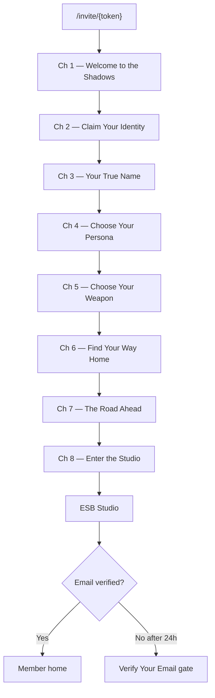
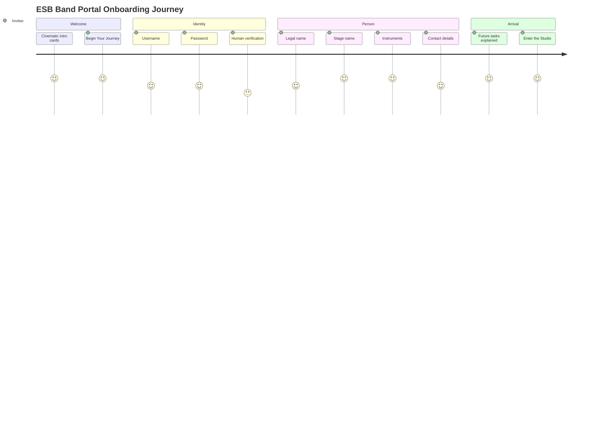

# UX Model

Status: PH049 Amended (ESB Studio Musician Evaluation Prohibition)  
Authority: `docs/PROJECT_CHARTER.md`  
Purpose: Canonical user experience, screen behaviour, and operational workflows for the Live Performance Orchestration System

Related documents:

- Navigation structure: `docs/INFORMATION_ARCHITECTURE.md`
- Runtime behaviour: `docs/RUNTIME_MODEL.md`
- Entity definitions: `docs/DOMAIN_MODEL.md`

This document defines **what** users see, **who** sees it, **when** they see it, and **why**. It does not define **how** it is implemented.

---

## PH003.01 — User Personas

### Hard Rule

**The Director is the primary user of the system.**

All UX decisions serve the Director's ability to prepare and run shows. Other personas are supported workflows within that mission.

---

### 1. Director

**Purpose:** Owns the production. Designs shows, prepares performances, and runs live execution.

**Primary responsibilities:**

- Author and maintain master library assets
- Configure Shows and Productions
- Prepare Performances (assignments, playlist validation, production assets)
- Run Soundcheck and Live Show View
- Coordinate musicians and tech during show day

**Screens used most frequently:**

- Show Dashboard
- Playlist
- Live Show View
- Soundcheck
- Assignments
- Songs (via preparation)

**Show-time responsibilities:**

- Operate Live Show View
- Monitor runtime state, connections, and action failures
- Oversee Soundcheck and Readiness
- Resolve assignment gaps and production warnings
- Run the active Performance

**Preparation responsibilities:**

- Import and validate playlist from Ableton Show File
- Configure assignments, charts, mix moves, light modes
- Create and schedule Performances
- Sync data to Local Show Runtime before show day

---

### 2. Musician

**Purpose:** Perform live. Receive guidance, charts, and monitoring control on a personal device.

**Primary responsibilities:**

- Connect device during Soundcheck and performance
- Confirm chart visibility and personal readiness
- Follow cue context and instructions
- Adjust personal monitoring during Soundcheck and live performance

**Screens used most frequently:**

- My Performances
- Current Performance (Musician Device View)
- Chart / Snippet view
- Monitor controls

**Show-time responsibilities:**

- View Previous / Current / Next Cue
- Read instructions and chart snippets for assigned role(s)
- Adjust monitoring (More/Less Me, Click, Tracks)
- Optionally browse charts manually

**Preparation responsibilities:**

- Review assigned Performances when available
- Validate charts during Soundcheck
- Confirm device and ears readiness

---

### 3. Tech

**Purpose:** Support production systems — audio, lighting, and infrastructure — during preparation and show day.

**Primary responsibilities:**

- Validate X32, lighting, and integration connections
- Support Soundcheck (system readiness)
- Monitor Console and Lights screens during preparation
- Assist Director during connection or action failures

**Screens used most frequently:**

- Soundcheck (system readiness)
- Console
- Lights
- Tech Rider
- Stage Plot

**Show-time responsibilities:**

- Monitor connection state surfaced in Live Show View
- Respond to X32 or lighting action failures
- Support monitor routing via Monitor Assignments context

**Preparation responsibilities:**

- Review Tech Rider and Stage Plot
- Validate Mix Moves and Light Modes configuration
- Confirm integration readiness before Soundcheck

---

### 4. Administrator

**Purpose:** Manage platform access, band configuration, and infrastructure — not live production operation.

**Primary responsibilities:**

- Manage user accounts and authentication
- Configure Band-level settings
- Oversee cloud sync and backup
- Support Director with platform issues outside show time

**Screens used most frequently:**

- Login / access management
- Master Library (band-level management)
- Production Configurations

**Show-time responsibilities:**

- Minimal — Administrator does not operate live performance
- Available for infrastructure support if requested

**Preparation responsibilities:**

- User and access provisioning
- Platform health and sync verification
- Band and device registry maintenance

---

## PH003.02 — Navigation Model

See `docs/INFORMATION_ARCHITECTURE.md` for canonical navigation hierarchy and visibility rules.

**Principle:** The application is **Show-centric**. Everything operates within an **Active Show** context after show selection.

Show-time execution (Live Show View, Soundcheck) requires an active **Performance** within the Active Show — the Director runs a Performance, not a Show alone.

---

## PH003.03 — Frontend Priority Model

Design from the performance moment backwards.

| Priority | Surface | Why |
|----------|---------|-----|
| **1** | Live Show View | The show is happening now. Operator must read state instantly under pressure. Failure here compromises the performance. |
| **2** | Soundcheck View | Last validation before live execution. Musicians and systems must be ready. Directly gates performance quality. |
| **3** | Show Preparation | Required to make Live Show View and Soundcheck succeed. Must not compromise priority 1 or 2. |
| **4** | Master Library Management | Foundational assets that Shows reference. Important but not show-day critical. |

### Hard Rule

**All UX decisions must be justified against Live Show View priority.**

If a preparation or library feature would add complexity, latency, or cognitive load to Live Show View — it must be rejected or deferred.

### Priority Justification

- **Live Show View first** because live performance is the highest priority (charter: *the show must go on*).
- **Soundcheck second** because unreadiness discovered during performance is costlier than discovery before.
- **Show Preparation third** because preparation exists to serve performance — not the reverse.
- **Master Library last** because reusable assets support Shows but are not the centre of show-day gravity.

---

## PH003.04 — Live Show View

**The most important screen in the system.**

### Purpose

Give the Director (operator) immediate, readable awareness of runtime state during live performance — and surface failures without blocking the show.

### Users

- **Primary:** Director (operator)
- **Secondary:** Tech (monitoring connections and action failures)

### Displayed Information

**Timeline (from Ableton):**

- Current Song
- Previous Song
- Next Song
- Current Cue
- Previous Cue
- Next Cue

**Runtime state:**

- Active Performance (venue, date)
- Performance state (live, paused if applicable)
- Cue 0 / Preparation indicator when CC16 = 0

**Connection state:**

- Ableton link status
- X32 link status
- Lighting link status
- Musician device connection summary

**Operational awareness:**

- Action execution failures (logged, non-blocking)
- Assignment coverage warnings
- Readiness carryover warnings from Soundcheck (informational)

### Interaction Rules

- **Read-first** — primary mode is monitoring, not editing.
- **No timeline override** — operator cannot advance or change cues; Ableton is authoritative.
- **Failures visible, not blocking** — action failures and warnings are surfaced; performance continues.
- **Minimal interaction required** — operator should not need multi-step actions during performance.
- **Large-format capable** — must be readable at distance (stage-side monitor, FOH tablet).
- **Show-safe** — no destructive actions, no sync operations, no cloud dependencies during live execution.
- **Works under pressure** — high contrast, clear hierarchy, no dense configuration UI.

### Behaviour Principles

- Fast to read
- Minimal cognitive load
- Show-safe
- Large-format capable
- Works under pressure
- Operable during live performance

Do not define implementation. Behaviour only.

---

## PH003.05 — Musician Device Experience

Separate navigation path from Director Show-centric app.

### Navigation

```
Login
 ↓
My Performances
 ↓
Current Performance
```

### Purpose

Deliver musician-centric guidance for the active Performance — charts, cues, instructions, and monitoring — without instrument-centric fragmentation.

### Required Views

| View | Content |
|------|---------|
| Previous Cue | Prior section name/context |
| Current Cue | Active section name/context |
| Next Cue | Upcoming section name/context |
| Assigned Instrument Part | Current role for this Performance/Song/Cue |
| Current Chart | Chart for assigned Instrument Part |
| Current Snippet | Snippet for current Cue and assigned SongInstrumentPart (automatic by default) |
| Next Snippet | Snippet for next cue in sequence (lookahead) |
| Next +1 Snippet | Snippet for second lookahead cue |
| Instructions | Musician-specific guidance (including Cue 0 preparation) |
| Full Chart Mode (optional) | Entire Chart for assigned SongInstrumentPart — display override |

### Required Rules

| Rule | Statement |
|------|-----------|
| Automatic navigation | Chart/snippet navigation follows cue changes by default. |
| Manual browsing | Musician may browse charts/snippets manually; display-only override. |
| Musician-centric | View consolidates all assignments for the musician — not one view per instrument. |
| Not instrument-centric | Musician does not select an instrument identity; system resolves from Assignment. |
| Monitor controls | More/Less Me, Click, Tracks available during Soundcheck and live performance. |
| Timeline authority | Musician device never controls cue progression. |

### Chart Mode vs Cue View (Musician Preparation)

| Mode | When | Behaviour |
|------|------|-----------|
| **Chart Mode** | Song/chart preparation | View full Chart for SongInstrumentPart; crop region; select target Cue (empty cues only in normal list); save independent Snippet |
| **Cue View** | Live performance / review | View current, next, and next+1 Snippets; clone snippet to another cue (creates copy); annotate/markup existing Snippet; optional full chart mode |

Cloning a snippet from another cue creates an independent copy — snippets are not shared between cues.

Photo or drawing capture may be used as a Snippet source without chart cropping.

### When Shown

- During Soundcheck (validation mode)
- During live performance (guidance mode)
- Requires device belonging to authenticated Musician

---

## PH003.06 — Soundcheck Experience

### Purpose

Collaborative pre-performance validation across system, production, and musician readiness before Live Show View execution.

### Workflow

```
Enter Soundcheck (from Active Show / Performance)
    ↓
System checks (Ableton, X32, lighting, Local Runtime)
    ↓
Production checks (playlist mapping, assignments, actions)
    ↓
Musician checks (devices, charts, ears, personal readiness)
    ↓
Aggregate Readiness (Ready / Warning / Not Ready per dimension)
    ↓
Director proceeds to Live Show View (warnings may remain)
```

### Readiness Dimensions

| Dimension | What Is Validated |
|-----------|-------------------|
| **System readiness** | Ableton connection, X32 connection, lighting connection, Local Runtime health |
| **Production readiness** | Playlist imported, PGM mapping valid, assignments coverage, actions configured |
| **Musician readiness** | Device connections, chart visibility, monitor checks, personal confirmations |

### Musician Readiness

Each musician may:

- Connect device
- Confirm chart visibility
- Check ears / adjust monitoring
- Confirm personal readiness

### Device Readiness

- Musician devices connected to Local Show Runtime
- Device-to-Musician binding verified

### Monitoring Readiness

- Monitor Assignments applied
- Musicians validate personal monitor mix during Soundcheck

### Required States

| State | Meaning |
|-------|---------|
| **Ready** | Dimension fully validated. |
| **Warning** | Issue noted; performance may proceed at operator discretion. |
| **Not Ready** | Significant gap; operator should resolve or explicitly accept fallback. |

### Collaborative Readiness Model

- Readiness is **collaborative** — system, production, and musician dimensions are independent.
- Warnings do **not necessarily block** performance (see `docs/RUNTIME_MODEL.md` §10).
- Director makes final proceed decision.
- Missing coverage may fall back to Ableton; gaps are logged.

### Users

- **Primary:** Director
- **Participants:** Musicians (personal readiness)
- **Support:** Tech (system readiness)

---

## PH003.07 — Show Preparation Experience

### Purpose

Prepare an Active Show and its Performances so Live Show View and Soundcheck can succeed.

### Preparation Areas

| Area | Purpose |
|------|---------|
| **Playlist** | Import and validate song order from Ableton Show File; map PGM to Songs |
| **Song preparation** | Link Songs, validate cues, actions, charts for show playlist |
| **Assignments** | Map musicians to instrument parts per Performance/Song/Cue |
| **Charts** | Ensure charts and snippets exist for required instrument parts |
| **Mix Moves** | Configure and reference reusable X32 actions |
| **Light Modes** | Configure and reference reusable lighting looks |
| **Stage Plot** | Document spatial layout for show variant |
| **Tech Rider** | Document technical requirements for venues/crew |

### Documented Finding

**Playlist is currently the centre of gravity of preparation activity.**

Rationale:

- Playlist is imported from the authoritative Ableton Show File.
- Song order and PGM mapping drive all downstream preparation (assignments, charts, actions).
- Most preparation workflows begin from playlist context: *which songs are in this show, in what order*.
- Other preparation areas radiate from playlist — Songs, Assignments, Console, Lights.

UX implication: Playlist screen is the natural hub within Show Preparation priority tier.

### Users

- **Primary:** Director
- **Occasional:** Tech (Tech Rider, Stage Plot, Console, Lights)

### Constraints

- Preparation must not compromise Live Show View or Soundcheck UX quality.
- Playlist is imported, not authored — preparation validates and enriches, does not replace Ableton.

---

## PH003.08 — Master Library Experience

### Purpose

Manage reusable global assets that Shows reference.

### Managed Assets

- Songs
- Musicians
- Devices
- Instrument Parts
- Mix Moves
- Light Modes
- Production Configurations

(Capabilities, Charts, Snippets, Cues, Actions are managed within Song context.)

### Hard Rule

**Master Library supports Shows. Master Library is not the primary user workflow.**

The Director's primary journey is Show-centric (prepare and run Shows). Master Library is accessed when assets need creation or maintenance — not as the daily entry point.

### Users

- **Primary:** Director
- **Secondary:** Administrator (band-level management)

### When Used

- Creating new Songs, Musicians, Mix Moves, etc.
- Maintaining assets between show cycles
- Not during live performance

---

## PH003.09 — Screen Catalogue

Canonical screen inventory.

| Screen | Purpose | Primary User | Priority | Show-Time Relevance |
|--------|---------|--------------|----------|---------------------|
| **Login** | Authenticate user | All | — | Required to access system |
| **Shows** | List and select Shows | Director | 3 | Select Active Show before show day |
| **Show Dashboard** | Active Show hub; navigate to preparation and performance screens | Director | 3 | Entry point for show-day operations |
| **Playlist** | View/import playlist from Ableton Show File; validate PGM mapping | Director | 3 | Validated before show; read-only at show time |
| **Live Show View** | Runtime operator view during live performance | Director, Tech | **1** | **Primary show-time screen** |
| **Soundcheck** | Collaborative pre-performance validation | Director, Musicians, Tech | **2** | Show-day, pre-performance |
| **Musicians** | Manage available musicians and device connections for Performance | Director | 2–3 | Show-day setup |
| **Devices** | View/register musician devices | Director, Administrator | 4 | Preparation; device binding |
| **Assignments** | Map musicians to instrument parts (Performance/Song/Cue) | Director | 3 | Prepared pre-show; read at show time |
| **Monitor Assignments** | Configure monitor mix routing | Director, Tech | 3 | Soundcheck and show time |
| **Songs** | Manage global Song assets | Director | 4 | Preparation |
| **Charts** | Manage charts and snippets within Songs | Director | 4 | Preparation |
| **Mix Moves** | Manage reusable X32 actions | Director, Tech | 4 | Preparation; executed at show time |
| **Light Modes** | Manage reusable lighting looks | Director, Tech | 4 | Preparation; executed at show time |
| **Stage Plot** | View/edit spatial layout document | Director, Tech | 3 | Informational; venue coordination |
| **Tech Rider** | View/edit technical requirements document | Director, Tech | 3 | Informational; venue advance |
| **Production Configurations** | Manage production wiring templates | Director | 4 | Preparation |
| **My Performances** | Musician list of assigned Performances | Musician | 2 | Musician entry point |
| **Current Performance** | Musician Device View for active Performance | Musician | **1–2** | Soundcheck and live performance |

### Screens Not Listed Separately

| Concept | Notes |
|---------|-------|
| **Console** | X32 / Mix Move execution context — may be panel within Live Show View or linked screen; Priority 1 at show time |
| **Lights** | Light Mode execution context — may be panel within Live Show View or linked screen; Priority 1 at show time |
| **Instruments** | Instrument Part requirements view within Active Show; Priority 3 |
| **Readiness** | Gate state display — part of Soundcheck flow; Priority 2 |
| **Master Library hub** | Navigation entry to Songs, Musicians, etc.; Priority 4 |

---

## PH003.10 — UX Principles

| # | Principle | Statement |
|---|-----------|-----------|
| 1 | **Show First** | Design from live performance backwards. Live Show View is the centre of gravity. |
| 2 | **Musician Guidance** | Assist musicians with cues, charts, and instructions — do not trap them. Override allowed. |
| 3 | **Minimal Cognitive Load** | Show-time screens are read-first, clear, and fast — especially Live Show View. |
| 4 | **Local First** | Show-time UX runs on Local Show Runtime. No cloud dependency during performance. |
| 5 | **Offline Safe** | All show-time screens function without internet. |
| 6 | **Ableton Authority** | UX displays timeline from Ableton. Users never override cue progression in UI. |
| 7 | **The Show Must Go On** | Failures are visible but non-blocking. Degraded guidance beats halted UI. |
| 8 | **Preparation Supports Performance** | Preparation and library UX exist to serve Live Show View — not compete with it. |

### Application of Principles

Every screen, workflow, and interaction must be traceable to at least one principle. Conflicts resolve in favour of higher-priority principles (Show First > Musician Guidance > Minimal Cognitive Load > … > Preparation Supports Performance).

**Band Portal exception (PH048A / PH049):** Principles 1–8 govern the Live Performance Orchestration System (Director, Local Show Runtime, show day). Band Portal narrative onboarding and ESB Studio are a **separate cloud surface** governed by Decisions **178–181**, **178A**, and PH048A/PH049 below. Band Portal UX serves member initiation, personnel administration, and factual preparation access — not live show execution and not musician evaluation.

---

## PH048A — ESB Band Portal Narrative Onboarding Experience

Authority: Decisions **178–181** (`docs/DECISION_LOG.md` PH048A)

**Scope:** UX and experience design only. No authentication, invitations, database writes, email sending, or session handling in this phase.

### Core UX principle (Decision 178)

The ESB Band Portal onboarding experience is a **guided narrative journey** — not a traditional registration form.

Users arrive via invitation and must feel they are **entering a new world**: welcomed, curious, excited, valued, invited into something special.

| Mandate | Avoid |
|---------|-------|
| Artistic, immersive, cinematic, memorable | Generic corporate registration language |
| Progressive storytelling | Large forms |
| One field at a time | "Sign up" experiences |
| Cinematic cards, alpha fades, progressive reveals | Enterprise onboarding patterns |

### Entry point

Users arrive via invitation URL:

```text
https://band.edandtheshadowboys.com/invite/{token}
```

The invitation token is part of the onboarding narrative. Token validation and persistence are **out of scope** for PH048A scaffold.

### Chapter structure (Decision 179)

Onboarding is divided into **eight chapters**. Progress feels like moving through a story, not completing forms.



### Storyboard overview



---

### Chapter 1 — Welcome to the Shadows

| Attribute | Value |
|-----------|-------|
| **Purpose** | Introduce ESB; explain why the invitee is here and what happens next |
| **Title** | Welcome to the Shadows |
| **Tone** | Cinematic cards — slide and fade; not a traditional slideshow |

**Opening message:** The user is present because they have been invited to join Ed and the Shadow Boys. Explain why they are here, what will happen, what information will be requested, and why.

| Card | Headline | Message |
|------|----------|---------|
| 1 | Create Your Identity | You will create the credentials used to access the ESB Studio. |
| 2 | Tell Us Who You Are | We collect legal identity information required for travel, accommodation, touring and administration. |
| 3 | Choose Your Persona | Tell us what the world should call you. |
| 4 | Choose Your Weapon | Tell us what instrument you play. |
| 5 | Enter the Studio | Once complete, you will gain access to the ESB Studio. |

**Final action:** `Begin Your Journey`

---

### Chapter 2 — Claim Your Identity

| Attribute | Value |
|-----------|-------|
| **Purpose** | Create authentication credentials (User entity — PH047) |
| **Pattern** | One field at a time; each fades in after previous completion |
| **Security** | Honeypot field; human verification; progressive appearance |

**Sequence:**

```text
Username → Password → Confirm Password → Human Verification
```

| Field | Rules (Decision 176 / 177) |
|-------|---------------------------|
| Username | 3–32 chars; letters and numbers only; no symbols or spaces; case-insensitive; stored lowercase |
| Password | 8–50 chars; uppercase + lowercase + number + symbol required |
| Confirm Password | Must match password |

No full form visible at once.

---

### Chapter 3 — Your True Name

| Attribute | Value |
|-----------|-------|
| **Purpose** | Capture legal travel identity (Person entity — PH045) |
| **Explanation** | Used exactly as it appears on travel documentation — required for flights, accommodation, touring logistics, official administration |

**Sequence:** `First Name` → `Middle Name` → `Surname`

Multiple middle names may be entered together in the middle name field. One field at a time.

---

### Chapter 4 — Choose Your Persona

| Attribute | Value |
|-----------|-------|
| **Title** | What Should the World Call You? |
| **Purpose** | Capture stage identity (Person artistic/stage name) |
| **Explanation** | Some members use their own name; some use something entirely different. The choice is theirs. |
| **Field** | Stage Name — single focus |

---

### Chapter 5 — Choose Your Weapon

| Attribute | Value |
|-----------|-------|
| **Title** | Choose Your Weapon |
| **Purpose** | Capture musical identity |
| **Explanation** | Every member contributes something unique. Tell us what instrument you play. |
| **Data** | Canonical `instrument_reference` / `person_instruments` many-to-many (PH045) |
| **UX** | Expressive selection — avoid generic enterprise dropdown where possible |

---

### Chapter 6 — Find Your Way Home

| Attribute | Value |
|-----------|-------|
| **Purpose** | Capture communication details (Person contact fields) |

**Sequence:** `Email Address` → `Telephone Number` → `City` → `Country`

One field at a time. Progressive reveal.

---

### Chapter 7 — The Road Ahead

| Attribute | Value |
|-----------|-------|
| **Purpose** | Set expectations — reassuring, not administrative |
| **Tone** | Onboarding is not fully complete today |

**Future profile tasks (not required today):**

- Passport information
- Bank account details
- Artist image
- Biography
- Additional touring information

These will be required before touring and operational activities.

---

### Chapter 8 — Enter the Studio

| Attribute | Value |
|-----------|-------|
| **Title** | Enter the Studio |
| **Purpose** | Reward and destination (Decision 180) |

The user gains access to **ESB Studio** — the post-onboarding member home, future login destination, and primary authenticated portal landing page.

---

### ESB Studio (Decision 180)

| Role | Statement |
|------|-----------|
| **Onboarding destination** | Chapter 8 arrival surface |
| **Member home** | Primary authenticated landing after onboarding |
| **Future login destination** | Returning members authenticate to Studio (not re-onboard) |
| **Primary portal landing** | Replaces generic "dashboard" framing |

ESB Studio is a **UX destination** — not a separate domain entity. It surfaces Person-linked member content and progressive profile completion.

---

## PH049 — ESB Studio Musician Evaluation Prohibition

Authority: Decision **178A** (`docs/DECISION_LOG.md` PH049)

**Scope:** UX and behavioural governance for ESB Studio. No implementation in this phase.

### Core UX principle (Decision 178A)

ESB Studio is a **facilitation and preparation platform**. It must not behave like a performance-management or talent-evaluation system.

| Mandate | Avoid |
|---------|-------|
| Present factual preparation information | Readiness scores, traffic lights, or inferred preparedness |
| Support collaboration and resource access | Musician quality, engagement, or productivity ratings |
| Show what exists (charts, assignments, plans) | Practice scores, participation scores, performance ratings |
| Leave artistic judgement to humans | League tables, leaderboards, rankings |

### Permitted factual surfaces

| Surface | Examples |
|---------|----------|
| Assignments | Songs assigned to a performance |
| Charts | Charts available; charts updated |
| Collaboration | Notes added; messages and activity |
| Planning | Running plans; rehearsal materials |
| Calendar | Upcoming performances |
| Administration | Administrative requirements |

### Human interpretation boundary

Whether a musician is ready for rehearsal or performance is **not** a Studio UX decision. Musical director, band leadership, rehearsal process, and professional judgement own that interpretation.

### Relationship to Soundcheck / Readiness

Soundcheck and Performance Readiness (Decisions 035, 047, 048) are collaborative, operator-led processes on the **live performance layer**. PH049 prohibits translating those concepts into musician scores or rankings inside ESB Studio.

---

### Email verification (Decision 181)

| Attribute | Value |
|-----------|-------|
| **Sender** | `bookings@edandtheshadowboys.com` (behind the scenes) |
| **Trigger** | After Chapter 6 email capture (implementation phase) |
| **Pending status** | Email Pending Verification |

**Gate rule:** If verification remains incomplete **after 24 hours**, the user may authenticate but **may not access ESB Studio**. Instead show **Verify Your Email** with resend verification, instructions, and support guidance.

Verification must occur before Studio access is granted.

Email remains a **contact identifier on Person** (PH047) — not a login identifier. Verification governs **Studio access**, not authentication identity.

---

### Invitation management (planned — not PH048A)

Administrator invitation interface is part of the onboarding ecosystem (implementation later).

| Status | Meaning |
|--------|---------|
| Draft | Created, not yet sent |
| Sent | Delivered to invitee |
| Accepted | Onboarding completed / User created |
| Expired | Past expiry date |
| Revoked | Administrator cancelled |

Tracked fields: `person_id`, expiry, `accepted_at`, `created_by`, status.

---

### PH048A out of scope

| Not in PH048A |
|---------------|
| Authentication implementation |
| User creation |
| Invitation validation |
| Database writes |
| Password storage |
| Email sending |
| Session handling |
| Profile persistence |

PH048A establishes the **experience scaffold** only. Implementation follows in later phases (PH048+).

---

End of UX Model — PH049
